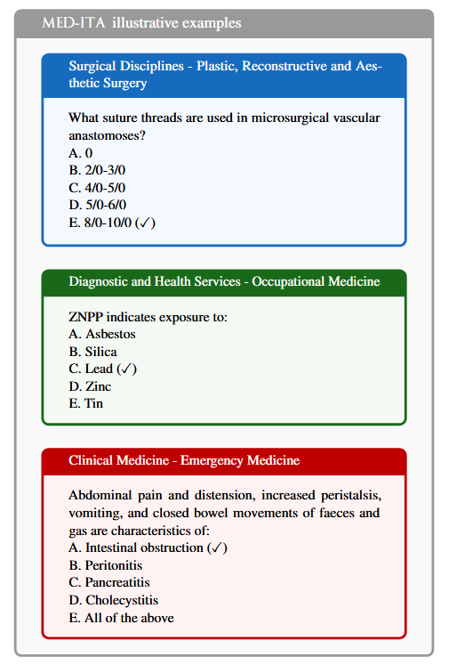
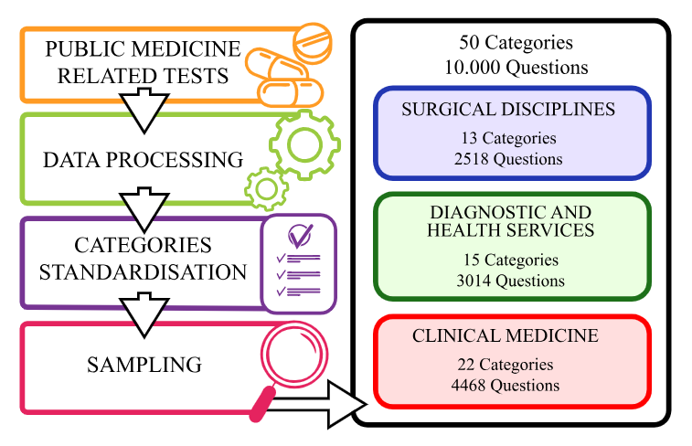

# Dataset Card for MED-ITA

<!-- Provide a quick summary of the dataset. -->

We introduce MED-ITA, a large-scale evaluation benchmark designed to assess the medical knowledge and understanding capabilities of Large Language Models (LLMs) in the Italian language.

<p align="center">
  
</p>

Above are example questions from _MED-ITA_. **Note**: every example is a direct translation; the original questions are in Italian. The correct option is marked by (✓).

## Dataset Details

### Dataset Description

<!-- Provide a longer summary of what this dataset is. -->

The benchmark comprises 10,000 multiple-choice questions drawn from official national examinations used to certify and recruit medical professionals across the Italian healthcare system. MED-ITA covers 50 distinct clinical and biomedical categories, ranging from core medical sciences (e.g., pathological anatomy, pharmacology and clinical toxicology, clinical pathology) to specialised clinical disciplines (e.g., neurology, cardiac surgery, psychiatry) and cross disciplinary fields (e.g., legal medicine, health statistics and biometry).

MED-ITA offers the first fine-grained, domain-specific benchmark for Italian medical language understanding, providing a foundation for advancing culturally and clinically grounded AI applications in healthcare.

- **Curated by:** CRISP research centre https://crispresearch.it/
- **Language(s) (NLP):** Italian
- **License:** MIT

### How to Use

First, clone the MED-ITA repository to your local machine:

```bash
git clone https://github.com/Crisp-Unimib/MED-ITA
cd MED-ITA
```

To avoid conflicts with system packages, it's recommended to use a virtual environment:

```bash
python -m venv venv
source venv/bin/activate  # On Windows use: venv\Scripts\activate
```

MED-ITA requires some packages to work. Install them with:

```bash
pip install -r requirements.txt
```

MED-ITA requires vLLM for serving local models. Install it with:

```bash
pip install vllm[all]
```

Run the vLLM server with your preferred model. Here’s an example using meta-llama/Llama-3.3-70B-Instruct:

```bash
vllm serve meta-llama/Llama-3.3-70B-Instruct
```

Once the vLLM server is running, you can tweak setting in `config.yaml`, such as model name, API endpoint, temperature, max tokens.
You can then execute the evaluation script:

```bash
python run_eval.py
```

To run the 100 hard questions (which include the top 2 hardest from each category), you need to update the configuration file to point to the appropriate dataset.

Open `config.yaml` and modify the `data_file` field under the `data` section as shown below:

```yaml
data:
  data_file: ./dataset_hard.jsonl # <-- Change this line
  output_dir: results
```

### Dataset Sources

<!-- Provide the basic links for the dataset. -->

- **GitHub:** https://github.com/Crisp-Unimib/MED-ITA
- **Huggingface:** https://huggingface.co/datasets/Crisp-Unimib/MED-ITA
- **Zenodo:** https://doi.org/10.5281/zenodo.16631997
- **Paper:** SUBMITTED AT KDD

## Dataset Structure

<!-- This section provides a description of the dataset fields, and additional information about the dataset structure such as criteria used to create the splits, relationships between data points, etc. -->

_MED-ITA_ contains 10,000 carefully curated questions selected from an initial corpus of 104,876 questions.

Each question is formatted as a multiple-choice query, with an average question length of 67.6 characters and 5 answer options.
The longest question is 700 characters long. The total number of tokens in the input data, which includes the question, options, and prompt template, is 1,719,397.

| Column           | Data Type | Description                                     |
| ---------------- | --------- | ----------------------------------------------- |
| `question`       | [String]  | The actual content of the question              |
| `options`        | [List]    | The options to choose from. Only one is correct |
| `answer`         | [String]  | The correct answer out of the options           |
| `category`       | [String]  | The dedicated category of the question          |
| `macro_category` | [String]  | The macro category of the question              |

## Dataset Creation

### Curation Rationale

<!-- Motivation for the creation of this dataset. -->

The corpus comprises questions and tasks from real-world exams, professional assessments, and domain-specific challenges.
Given that the data originates from institutional sources, it is expected to maintain a high standard of quality and accuracy, as domain experts crafted it for public evaluations.

### Source Data

<!-- This section describes the source data (e.g. news text and headlines, social media posts, translated sentences, ...). -->

#### Data Collection and Processing

<!-- This section describes the data collection and processing process such as data selection criteria, filtering and normalization methods, tools and libraries used, etc. -->

All documents were freely available and published between 2010 and 2024, typically in PDF, DOC, or HTML formats.

Please consult the full paper for a detailed description of our curation process.

<p align="center">
  
</p>

#### Who are the source data producers?

<!-- This section describes the people or systems who originally created the data. It should also include self-reported demographic or identity information for the source data creators if this information is available. -->

The raw dataset was compiled from official public sources, including national and regional public recruitment competitions, admission tests for medical degree programs and speciality schools, and official exam preparation materials published by public agencies.

#### Personal and Sensitive Information

<!-- State whether the dataset contains data that might be considered personal, sensitive, or private (e.g., data that reveals addresses, uniquely identifiable names or aliases, racial or ethnic origins, sexual orientations, religious beliefs, political opinions, financial or health data, etc.). If efforts were made to anonymize the data, describe the anonymization process. -->

The dataset does not contain confidential information.
It is also free from content that could be considered offensive, insulting, threatening, or distressing. Since it solely comprises data from standardised tests and does not involve human subjects or personal data, an ethical review process was not required.

## Bias, Risks, and Limitations

<!-- This section is meant to convey both technical and sociotechnical limitations. -->

MED-ITA is designed strictly for research evaluation purposes and should not be used to validate LLMs for direct clinical decision-making or patient care applications. The benchmark assesses knowledge recall and reasoning on standardised questions, which differ significantly from real-world clinical practice scenarios.

### Maintenance

To ensure responsible use of _MED-ITA_, the research team commits to making the complete dataset, evaluation protocols, and supplementary materials freely available under permissive licensing; maintaining clear versioning and update protocols to ensure longitudinal research validity and encouraging collaborative improvements and error reporting from the broader research community.

## Citation

<!-- If there is a paper or blog post introducing the dataset, the APA and Bibtex information for that should go in this section. -->

**BibTeX:**

```
SUBMITTED AT KDD
```

**APA:**

```
SUBMITTED AT KDD
```

## Dataset Card Contact

```
Andrea Seveso - andrea.seveso@unimib.it
```
